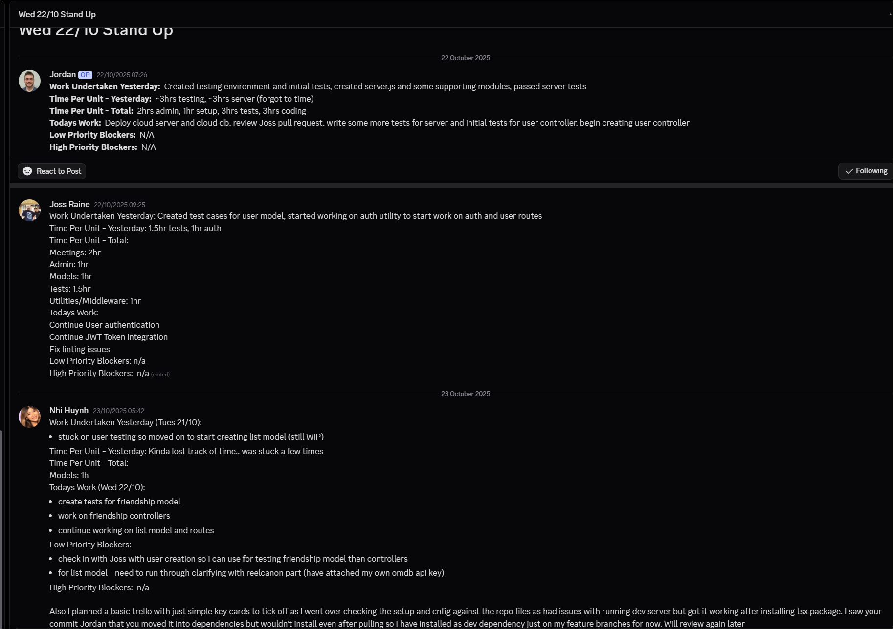
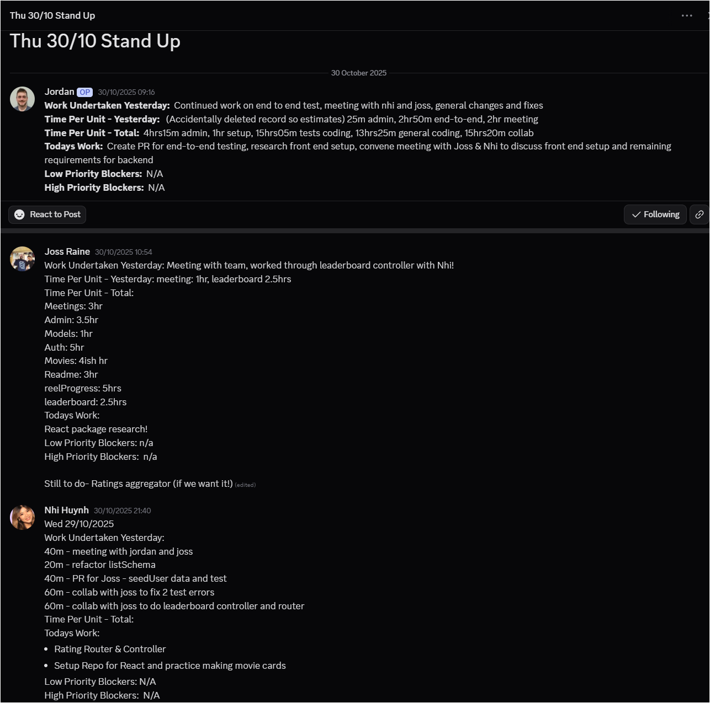
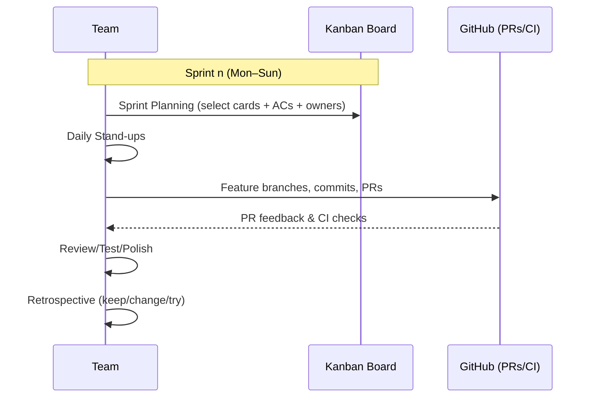
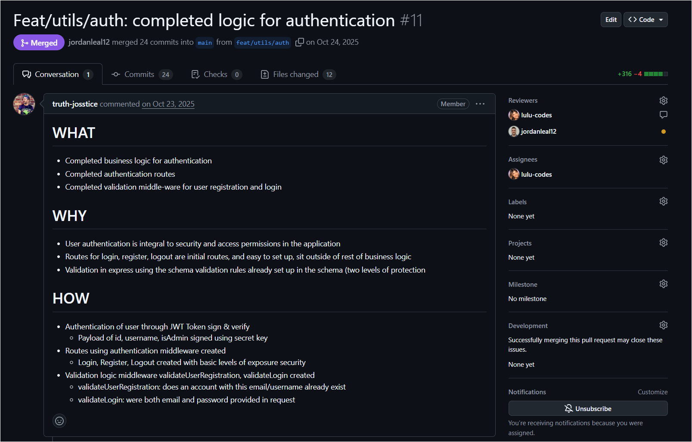
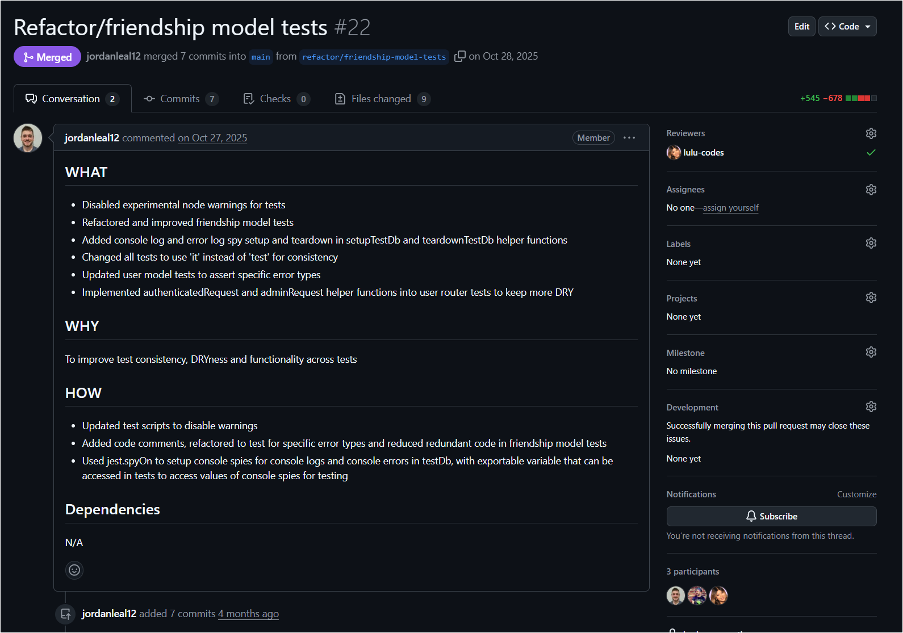
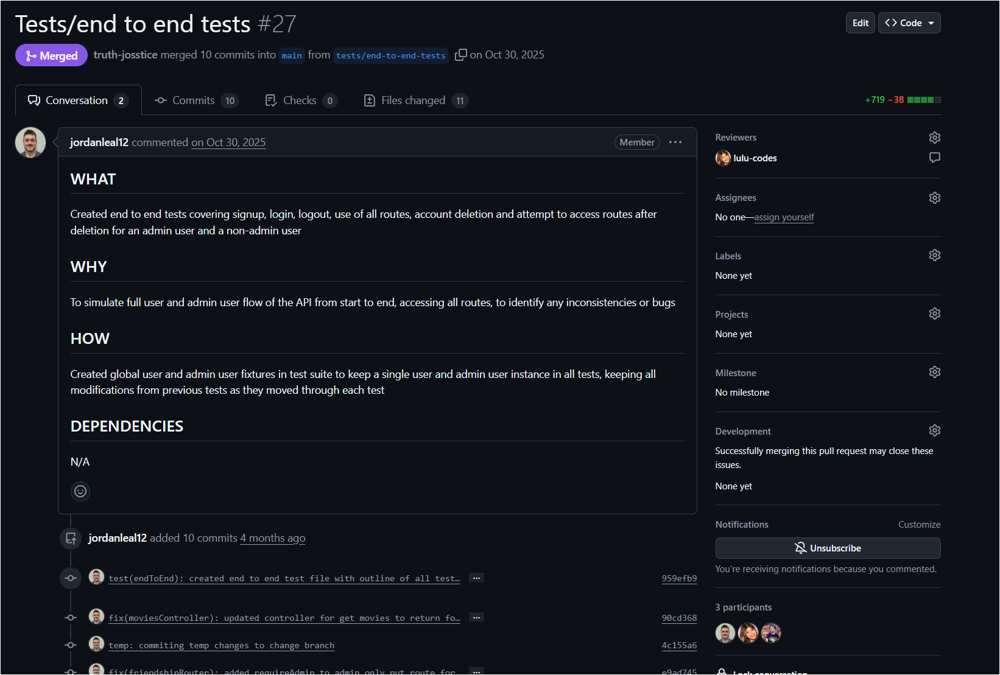
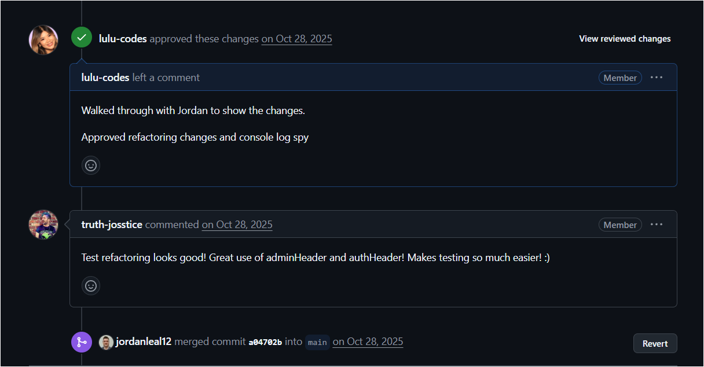
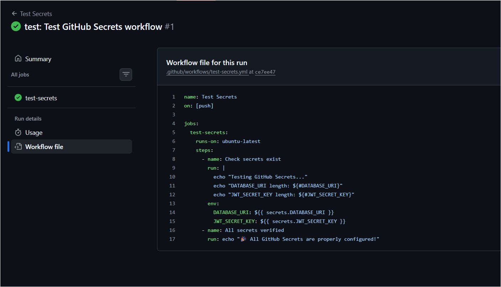
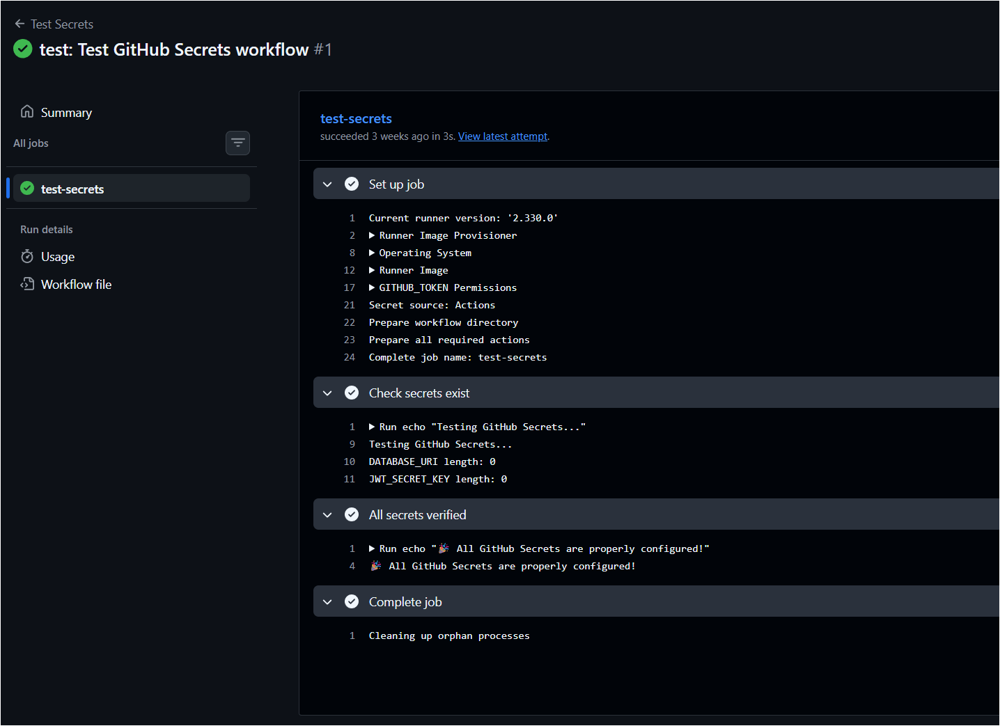

# Assessment Breakdown

## HD Requirements

### EXPLAINS the problem or scenario that a project is addressing to a professional level -Joss ඞ

- Explains the purpose, goal, problem or scenario that a project is addressing
  - _Choosing movies to watch. Address the need of social groups to plan and share movie watching experiences_
  - Uses AT LEAST ONE external source OR reference to support their explanation.
    - _Alex: "Find some reference that says 'people love movies, this percentage of people everywhere love movies, and have this problem' to solve it"_
  - How the purpose, goal or problem is being addressed by the project
    - _Alex: "Talk about what your project specifically does to solve the problem. Identifying the problem is not the same thing as solving the problem. Make sure you say 'This is how we are connecting the dots and solving the problem'"_
    - _which features address the needs and solve the problem_
    - _User stories from planning phase contains specific problems and solutions - use this_
  - Refers to AT LEAST ONE existing similar/competing project(s) to support their explanation.
    - _Letterboxd - offers a platform similar but less interactive UI: "Track films you’ve watched. Save those you want to see. Tell your friends what’s good."_
    - Referred project addresses the same problem or scenario (Letterboxd does)
  - Refers to target user information such as target market information OR user stories.
    - _Recycle user stories from planning project_

### EXPLAINS the process behind developing code to address a project’s needs - Ask Alex First

- _Alex: "This is basically how you as a team decide how your code is written. Like if someone's writing code in one branch, are you all together in that one branch or in separate branches? Having specific code examples would be beneficial."_
- _Alex: "Basically stuff like how you decide your git workflow, how you do your git branches and merges, and code examples could be before & after merging of code.if you have any automation workflows made to help with that sort of stuff, showing them would count as code examples too."_
- _Alex: "Basically stuff like how you decide your git workflow, how you do your git branches and merges, and code examples could be before & after of code._

- Explains the development process for code that addresses a project’s needs in descriptive terms
  - Provides AT LEAST TWO specific code examples OR mentions of project needs.

### IDENTIFIES & EXPLAINS problems and solutions during the programming of a project - All Three of (among)Us

- Identifies & explains AT LEAST THREE problems encountered during a relevant programming project
  - _This constitutes three total, so one per team member_
  - Explains a solution for EACH of those problems.
- At least ONE of these problems must be specific to each team member

- Nhi:
  - How the application architecture worked together/handles data (how to conceptually understand the application flow and how the components interact with each other).
  - Communication with team members on aspects they worked on to understand how their parts worked as part of the whole. Communicated through team stand-ups to identify blockers, review PRs, research/watch concept videos and discuss via call meetings.
- Joss:
  - Very specific issue with friend request systems and friends lists not always showing the correct data
  - 4hr debug with eventual solution being one single ternary expression reshaping data that did not appear consistently in the front end
- Jordan:
  - Done

### IDENTIFIES & EXPLAINS skills used AND grown during a project - All Three of Us

- Identifies skills used during a project
  - Explains how skills were used
- Identifies skills grown during a project
  - Explains how skills were grown.
- Each team member must talk about at least ONE feature OR piece of application functionality that they developed

- Nhi:
  - Version control workflow.
  - Learning how to resolve merge conflict issue and use of feature branching through practice and using a visual workflow guide to refer back to. This helped to reduce the fear of errors and improve my confidence using Git in a team environment.
- Joss:
  - Testing in general!
  - Developed test suites for all of the functions in the backend which related to my entities, middleware and logic (can show any test suite)
- Jordan:
  - Done

### PRESENTS a project’s result in a professional manner - Jordan (Done)

- Presents an application that was developed for the project
  - Application is COMPLETELY FINISHED and has NO issues or errors
  - The presentation of the application has ONE OR FEWER issues.

### EXPLAINS usage of a version control workflow with reference to a group project - Nhi

- _Alex: "Does not have to be GitHub Actions workflows specifically, it can be 'this is the process that we as a team have to work on branches in the repository', or how to approve pull requests or do mergers and such."_
- _Alex: "You must explain how your team used Git together, with reference to the project. Don't talk about branching etc. without referring to the project. Talk about working in a group with git processes"_
- _Alex: you can and should continue working on your project if it doesn't meet the requirements for the presentation. This is especially important for some of the teams who may not have worked on the project together before: if the project doesn't have a thing required to meet some part of the assessment, you should do that thing ASAP._

- Explains the usage of a version control workflow within the group project
  - Provides specific reference to, OR an example of ALL of the following features:
    - _Ask Alex if we need to have these implemented, or if we can just show an example of what it would look like_
    - Branching
      - _Feature branches, branch protection (could not push direct to main), PR requests with standard templates to follow, manual review process (each PR reviewed by 1 or more team members)_
    - Forking
      - _Did not implement, but we added documentation on contributors and how they would fork_
    - Automated testing
      - _Did not implement but forked version exists with this_
    - Automated building/deployment
      - _Netlify and Render auto deployment integrated with github repo, frontend auto build through netlify npm run build to deliver static sites on pushes to main branch_

### EXPLAINS how group communication was handled with regards to a project’s version control workflow - Nhi

- _Alex: How you and your team members figure out who is making what branch, how you communicate with each other about things like pull requests, stuff that is you talking to your teammates with regards to your git usage and processes and things like that."_
- Explains communication processes
  - References AT LEAST FOUR situations or scenarios that occurred during a project
    - _Look at old trello board to find specific feature branch allocations_
    - _Specifically cover the feature, how we communicated the reviewing of it, etc._
- References are relevant or give context to the project’s version control workflow.
- Explains the task allocation process within the team
  - _Did a google survey, figured out peoples strengths and had a meeting to allocate tasks_

#### Group Communication Process for Project Version Control Workflow

Throughout the planning, designing and development stages of our group project, we used the following tools to support our collaborative group approach to communicating, sharing resources, developing code, and managing version control workflow:

- GitHub
- Slack
- Discord
- Trello
- Zoom

##### **Scenario 1: General Communication & Shared Resources Tools**

- Discord was initially the first communication tool that we were using when we decided to work together for this group project.
- We found that as we were communicating and sharing resources in a single chat, it became easy to lose track of shared resources and decided on using a platform that allowed us to have separate chats and folders. Especially because we wanted to separate areas of concerns for our communication and shared resources, so things weren't easily missed in our group chat and make it easier to locate information we needed.
- We explored some industry standard tools such as Slack, which offered a free tier and was an accessible app for all group members and provided us with the tools that we needed.
- During the Planning Stage of our group project, we used Slack and set up our communication and resource sharing channels for:
  - general chat/asking questions
  - daily stand ups chat
  - project planning/meeting agenda notes where we shared our retrospectives on what our focus was for the sprint
  - assessment requirements checklist
- As it was a new tool and required a bit of learning to become familiar with how to navigate the app. During our development stages, we agreed to using Discord as the primary communication tool as it was more familiar to use as we had used it for our course study. This minimised the mental load to switching back and forth between the two apps and after exploring the Discord capabilities to set up our own organisation with multiple channels and threads for our needs, we found this to be a more seamless experience to communicate on.
- We applied Agile methodologies such as Daily Stand Ups to post what we were working on and share any blockers we had.
- Included below are a few examples of our daily stand ups:





##### Scenario 2: Task Management - Cards Allocations

- During the planning and designing stage, we created user stories and MVP features for our first release of the app.
- This helped us focus on our project scope and realistic goals and timeframe.
- We also completed a Google Survey form where we rated our current skills levels to gauge and understand as a team what were our key strengths and development areas.
- We created cards in our Trello board and allocated tasks to team members based on discussions around our skill levels and where we could contribute meaningfully and effectively.
- Our workflow included moving the cards along the Kanban board and updated them along as we progressed.
- Below is workflow we followed aligned with Agile methodology practices.

<https://github.com/CoderAcademy-DEV-MERN-Group/DEV1003-Assessment01/blob/main/task-mgmt-methodology.md>



##### Scenario 3: Version Control Workflow - Using GitHub Branching and PRs

- In terms of the version control workflow, we would create a new branch off the main branch when working on a new feature/task for example feat/friendships-controller
- When we completed a feature or task, we would commit changes, push from local to remote branch and then submit a pull request via GitHub. Another team member would then review this and run checks and tests, provide feedback and request any changes. If any changes were required, then the team member would make those changes and then request another PR. Once it was checked, approved and ready to be merged to the main branch, the reviewing team member would complete the merge. Following the merge to main, if there were any issues identified later then we would create another branch such as refactor/friendships-controller and repeat the above process again.
- To ensure we followed a consistent approach to the peer review checks for the pull requests, we used a standardised template which included:
  - **What** - was being completed in the pull request
  - **Why** - the justifications for what was being done
  - **How** - the development code works or tools and technologies used such as packages/functions
  - **Dependencies** - if there were any dependency changes including what and why






##### Scenario 4: Using GitHubs Actions for Automated Tests Workflow

- Following the coverage of learning about GitHub Actions and how we can use this to automate workflows, Joss created a YAML file to automatically run checks and tests on our environment variables and secret keys to ensure that secret keys existed and were configured on pushes.
  
  
- We can further leverage these automation workflows by creating GitHub Actions/Events such as running tests automatically on tasks such as linting, security checks, development tests etc to minimise the time to do this manually by our team.

---

### REFLECTS on how communication, collaboration and problem solving as a team could be improved for future development - All of Us

- _Alex: "If you could go back to day one and do the MERN project differently, what would you do differently?"_
- Any difficulties encountered developing the project as a team
  - _Nhi: Struggling to contribute effectively because of getting caught up trying to implement a perfect version and falling behind schedule_
  - _Joss: More clear and defined allocation of team roles before commencing the front end. Not finding appropriate skill to task allocation for each member for front end_
  - _Jordan: Feeling lost on direction of what part of the project to do next. Experiencing bottlenecks sometimes where the application was requiring a specific feature to proceed_
-
- Provides AT LEAST TWO improvements for EACH OF the following, that could be used for future development work:
  - **Communication processes**
    - _Matching what we did with skill to task allocation in the backend, across all projects_

    - _Using a platform like Trello to manage tasks more effectively_
    - _Consistently contribute to daily stand-ups to discuss blockers and update team on WIP_

    - **Nhi:** - Communication
      - _Early and effective communication when encountering programming issues or difficulties - "I don't understand how to..." at an earlier stage meaning more collaborative work could be completed_
      - Asking for help earlier.
      - I sometimes got stuck in a mode where I was trying to figure out how to handle the validation for bidirectional relationship of users being amyself like when I was building the friendships schema model
      - and wasn't sure how to handle the bidirectional relationship of friend requests. I spent quite a bit of time researching and trying to find resources to help guide myself. I recall finding similar solutions on StackOverflow, but often got caught up in trying to wrap my head around trying to decode the extra information in the solution example.

      ```javascript
      // Get friendship document by the combination of user1 and user2 ids where requestedUserId is user2
      // Sort id's by smallest id first
      const [user1, user2] = [requesterUserId, recipientUserId].sort();
      ```

  - **Collaboration processes**
    - _Have a specific project lead_
    - _More regular co-programming sessions to skill share earlier in the front end development_
    - _Identify bottlenecks early to avoid project slowdown_
  - **Problem solving processes**
    - _Spend more initial time on project planning_
    - _Applying Agile practices to review scope of planned deliverables in our MVP and reassessing realistic features and delivery timeframes_
  - At least one thing that that team member would do differently if given more time or a chance to redo the project
