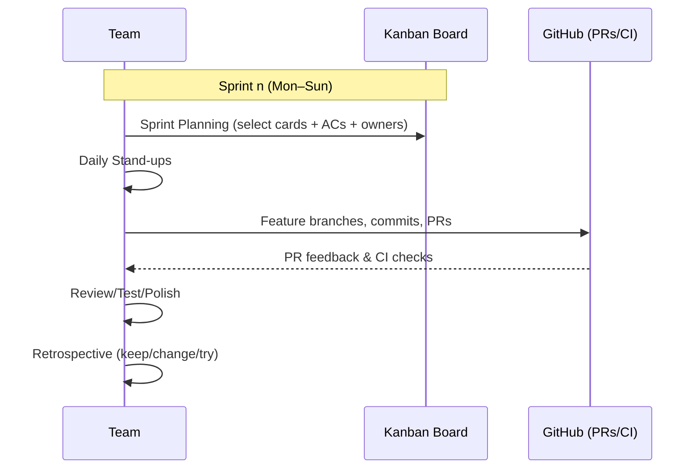

# Assessment Breakdown

## HD Requirements

<!-- ### Presents ALL of the following to a THOROUGH level of detail

- As part of the presentation, each group member must talk about their own:
  - Skills used throughout the project
  - Skills or experiences gained throughout the project
  - At least one feature or piece of application functionality that that team member developed
  - At least one problem or hurdle that that team member faced during the project & how it was
    overcome
  - At least one thing that that team member would do differently if given more time or a
    chance to redo the project -->

### EXPLAINS the problem or scenario that a project is addressing to a professional level -Joss ඞ

- Explains the purpose, goal, problem or scenario that a project is addressing
  - _Choosing movies to watch. Address the need of social groups to plan and share movie watching experiences_
  - Uses AT LEAST ONE external source OR reference to support their explanation.
    - _Alex: "Find some reference that says 'people love movies, this percentage of people everywhere love movies, and have this problem' to solve it"_
  - How the purpose, goal or problem is being addressed by the project
    - _Alex: "Talk about what your project specifically does to solve the problem. Identifying the problem is not the same thing as solving the problem. Make sure you say 'This is how we are connecting the dots and solving the problem'"_
    - _which features address the needs and solve the problem_
    - _User stories from planning phase contains specific problems and solutions - use this_
  - Refers to AT LEAST ONE existing similar/competing project(s) to support their explanation.
    - _Letterboxd - offers a platform similar but less interactive UI: "Track films you’ve watched. Save those you want to see. Tell your friends what’s good."_
    - Referred project addresses the same problem or scenario (Letterboxd does)
  - Refers to target user information such as target market information OR user stories.
    - _Recycle user stories from planning project_

### EXPLAINS the process behind developing code to address a project’s needs - Ask Alex First

- _Ask for an explanation before addressing this_
- Explains the development process for code that addresses a project’s needs in descriptive terms
  - Provides AT LEAST TWO specific code examples OR mentions of project needs.

### IDENTIFIES & EXPLAINS problems and solutions during the programming of a project - All Three of (among)Us

- Identifies & explains AT LEAST THREE problems encountered during a relevant programming project
  - Explains a solution for EACH of those problems.
- At least ONE of these problems must be specific to each team member
  - _It's unclear whether each team member has to contribute three problems individually of which one is their own, or each is to contribute at least one which totals three_
- Nhi:
  - How the application architecture worked together/handles data (how to conceptually understand the application flow and how the components interact with each other).
  - Communication with team members on aspects they worked on to understand how their parts worked as part of the whole. Communicated through team stand-ups to identify blockers, review PRs, research/watch concept videos and discuss via call meetings.
- Joss:
  - Very specific issue with friend request systems and friends lists not always showing the correct data
  - 4hr debug with eventual solution being one single ternary expression reshaping data that did not appear consistently in the front end
- Jordan:
  - "Premature optimization is the root of all evil". Getting caught up trying to figure out the perfect way to do things before implementing the simple way and getting lost in the details
  - Implementing a 'continuous improvement' style approach where I would make a basic version to get working and then improve gradually afterwards.

### IDENTIFIES & EXPLAINS skills used or grown during a project - All Three of Us

- Identifies skills used during a project
  - Explains how skills were used
- Identifies skills grown during a project
  - Explains how skills were grown.
- Each team member must talk about at least ONE feature OR piece of application functionality that they developed

- Nhi:
  - Version control workflow.
  - Learning how to resolve merge conflict issue and use of feature branching through practice and using a visual workflow guide to refer back to. This helped to reduce the fear of errors and improve my confidence using Git in a team environment.
- Joss:
  - Testing in general!
  - Developed test suites for all of the functions in the backend which related to my entities, middleware and logic (can show any test suite)
- Jordan:
  - Axios and tanstack
  - Looking at a bunch of tutorials, asking AI and just doing it (and failing a bunch)

### PRESENTS a project’s result in a professional manner - Jordan

- Presents an application that was developed for the project
  - Application is COMPLETELY FINISHED and has NO issues or errors
  - The presentation of the application has ONE OR FEWER issues.

### EXPLAINS usage of a version control workflow with reference to a group project - Nhi

- _Alex: "Does not have to be GitHub Actions workflows specifically, it can be 'this is the process that we as a team have to work on branches in the repository', or how to approve pull requests or do mergers and such"_
- Explains the usage of a version control workflow within the group project
  - Provides specific reference to, OR an example of ALL of the following features:
    - _Ask Alex if we need to have these implemented, or if we can just show an example of what it would look like_
    - Branching
      - _Feature branches, branch protection (could not push direct to main), PR requests with standard templates to follow, manual review process (each PR reviewed by 1 or more team members)_
    - Forking
      - _Did not implement, but we added documentation on contributors and how they would fork_
    - Automated testing
      - _Did not implement but forked version exists with this_
    - Automated building/deployment
      - _Netlify and Render auto deployment integrated with github repo, frontend auto build through netlify npm run build to deliver static sites on pushes to main branch_

### EXPLAINS how group communication was handled with regards to a project’s version control workflow - Nhi

- Explains communication processes
  - References AT LEAST FOUR situations or scenarios that occurred during a project
    - _Look at old trello board to find specific feature branch allocations_
    - _Specifically cover the feature, how we communicated the reviewing of it, etc._
  - References are relevant or give context to the project’s version control workflow.
  - Explains the task allocation process within the team
    - _Did a google survey, figured out peoples strengths and had a meeting to allocate tasks_

<https://github.com/CoderAcademy-DEV-MERN-Group/DEV1003-Assessment01/blob/main/task-mgmt-methodology.md>

### REFLECTS on how communication, collaboration and problem solving as a team could be improved for future development - All of Us

- _Alex: "If you could go back to day one and do the MERN project differently, what would you do differently?"_
- Any difficulties encountered developing the project as a team
  - _Nhi: Struggling to contribute effectively because of getting caught up trying to implement a perfect version and falling behind schedule_
  - _Joss: More clear and defined allocation of team roles before commencing the front end. Not finding appropriate skill to task allocation for each member for front end_
  - _Jordan: Feeling lost on direction of what part of the project to do next. Experiencing bottlenecks sometimes where the application was requiring a specific feature to proceed_
- Provides AT LEAST TWO improvements for EACH OF the following, that could be used for future development work:
  - Communication processes
    - _Matching what we did with skill to task allocation in the backend, across all projects_
    - _Early and effective communication when encountering programming issues or difficulties - "I don't understand how to..." at an earlier stage meaning more collaborative work could be completed_
    - _Using a platform like Trello to manage tasks more effectively_
    - _Consistently contribute to daily stand-ups to discuss blockers and update team on WIP_
  - Collaboration processes
    - _Have a specific project lead_
    - _More regular co-programming sessions to skill share earlier in the front end development_
    - _Identify bottlenecks early to avoid project slowdown_
  - Problem solving processes
    - _Spend more initial time on project planning_
    - _Applying Agile practices to review scope of planned deliverables in our MVP and reassessing realistic features and delivery timeframes_

"""
⣿⣿⣿⣿⣿⣿⣿⡿⠟⠋⠉⢁⣀⣀⣀⡈⠉⠛⢿⡿⠿⢿⣿⣿⣿
⣿⣿⣿⣿⣿⣿⠏⢀⣴⣾⣿⣿⣿⣿⣿⡟⠃⢀⣀⣤⣤⣄⠉⢿⣿
⣿⣿⣿⣿⣿⡏⠀⣾⣿⣿⣿⣿⣿⣿⠏⠀⣴⣿⣿⣿⣯⣻⣧⠀⢻
⣿⣿⣿⣿⣿⠁⢸⣿⣿⣿⣿⣿⣿⣿⠀⠸⣿⣿⣿⣿⣿⣿⣿⡇⠈
⣿⣿⣿⣿⡏⠀⣼⣿⣿⣿⣿⣿⣿⣿⣧⠀⠹⢿⣿⣿⣿⡿⠟⠀⣼
⣿⣿⣿⡿⠇⠀⠛⠿⣿⣿⣿⣿⣿⣿⣿⣷⣦⣀⡈⠉⠀⠀⣴⣿⣿
⣿⡿⠁⣀⢠⢤⣤⠀⠀⠉⢀⠀⠀⠈⠉⠻⢿⣿⣿⣿⡇⠀⣿⣿⣿
⡟⠀⣴⣽⣷⣷⠆⠀⣴⣾⣿⣔⡳⢦⡄⣄⣠⣿⣿⣿⡇⠀⣿⣿⣿
⠀⢰⣿⣿⣿⠇⠀⣼⣿⣿⣿⣿⣿⣷⣶⣿⣿⣿⣿⣿⣿⠀⢻⣿⣿
⠀⠸⣾⣿⣿⠀⢰⣿⣿⣿⣿⣿⣿⣿⣿⣿⣿⣿⣿⣿⣿⠀⢸⣿⣿
⣧⠀⠻⢿⣿⠀⠸⣿⣿⣿⣿⣿⣿⣿⣿⣿⣿⣿⣿⣿⣿⠀⢸⣿⣿
⣿⣷⣤⣀⣈⠀⠀⠙⢿⣿⣿⣿⣿⣿⣿⠟⠙⣿⣿⣿⡏⠀⣼⣿⣿
⣿⣿⣿⣿⣿⡇⠀⣄⠀⠙⠛⠿⠿⠛⠁⢀⣼⣿⣿⣿⡇⠀⣿⣿⣿
⣿⣿⣿⣿⣿⣷⡀⠘⠿⠶⠀⢀⣤⣤⡀⠙⢿⣿⣿⡿⠁⢰⣿⣿⣿
⢻⣿⣿⣿⣿⣿⣿⣦⣤⣤⣴⣿⣿⣿⣷⣄⣀⠈⠁⣀⣠⣿⣿⣿⣿
⣹⣿⣿⣿⡿⢋⣩⣬⣩⣿⠃⣿⣿⣿⣿⢸⣿⡿⢋⣡⣬⣩⣿⣿⣿
⡗⣿⣿⣿⣧⣈⣛⠛⠻⣿⠀⣿⣿⣿⡿⢸⣿⣧⣈⣛⠛⠻⣿⣿⣿
⣿⣿⣿⣿⠹⣿⣿⡿⠂⣿⣇⠸⣿⣿⠃⣼⣿⠻⣿⣿⡿⠀⣿⣿⣿
⣿⣿⣿⣿⣶⣤⣤⣴⣾⣿⣿⣶⣤⣤⣾⣿⣿⣶⣤⣤⣴⣾⣿⣿⣿
AMOGUS - BIG CHUNGUS painted by Joss Da Vinci
"""
